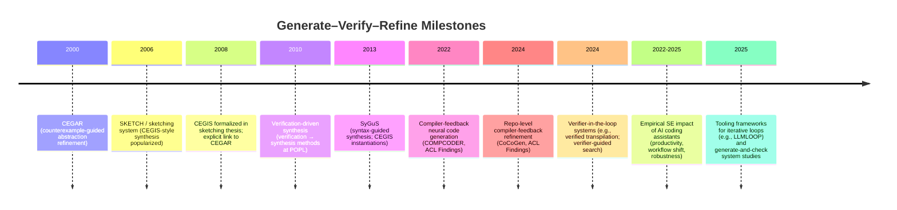

# Generate–Verify–Refine Loops in Program Synthesis and LLM Code Generation

## Executive summary

Generate–verify–refine is a family of iterative algorithms that (a) generate a candidate artifact, (b) verify it against an oracle (e.g., model checker, theorem prover, compiler, test harness, equivalence checker), and (c) refine the next attempt using the oracle’s feedback (counterexamples, error messages, failing tests, proof obligations). In classical formal methods and program synthesis, the canonical name for the counterexample-driven instantiation is **counterexample-guided inductive synthesis (CEGIS)**, introduced in the SKETCH/sketching line of work, and explicitly described as coupling an inductive synthesizer with a validation procedure that either accepts the candidate or returns a concrete counterexample to drive the next iteration. citeturn18view3turn18view1

CEGIS is historically and conceptually parallel to **counterexample-guided abstraction refinement (CEGAR)** in model checking, which iteratively refines an abstraction when a counterexample is spurious. citeturn18view3turn13view2 A broader umbrella term used in the synthesis literature is **oracle-guided inductive synthesis (OGIS)**, which explicitly frames the loop as a learner repeatedly querying an oracle; CEGIS is highlighted as a practically impactful instance of OGIS. citeturn13view0

In modern ML/AI code-generation systems, the same paradigm appears as **generate-and-check** or **generate–compile–repair** loops, where compilers/type checkers and execution/testing provide the “verifier/oracle” signal that drives revisions. One explicit description of “generate-compile-repair” appears in a 2025 position paper arguing that a strict type checker and fast compilation make such iterative loops practical. citeturn15view0 A closely related, increasingly common phrasing in LLM code-generation papers is **compiler feedback** or **compiler-feedback-driven iterative refinement**, e.g., COMPCODER and CoCoGen (ACL Findings 2022/2024) and tool frameworks such as LLMLOOP (ICSME 2025). citeturn17view0turn16view0turn15view3

Empirically, the industrial relevance of the paradigm is motivated by evidence that LLM-based code assistants shift effort from “writing” toward “reviewing/validating/repairing,” and that productivity gains depend on effectively constraining and checking generated code. Representative studies include controlled experiments and field evidence on entity["company","GitHub","software company"] Copilot’s productivity effects, and human studies observing new validation workflows around AI suggestions. citeturn10view1turn10view0turn9search1turn11search0turn15view5turn11search3

## Paradigm and canonical terminology

The central abstraction is an **iterative loop whose inner step is guarded by a checker**:

- **Generate:** propose candidate program/model/patch/proof.
- **Verify/Check:** decide whether it satisfies constraints (logical spec, type rules, compilation, tests, semantic equivalence).
- **Refine/Repair:** incorporate verifier feedback into the next candidate.

In formal methods, the most canonical names are:

- **CEGAR** (verification): iteratively refine an abstraction using counterexamples when verification fails (spurious counterexamples drive refinement). citeturn13view2  
- **CEGIS** (synthesis): iteratively refine a candidate program using counterexamples returned by a validation procedure; the SKETCH thesis explicitly credits CEGAR as an intellectual ancestor. citeturn18view3turn18view1  
- **OGIS** (umbrella): “oracle-guided inductive synthesis” explicitly models synthesis as repeated oracle queries; CEGIS is singled out as practically impactful. citeturn13view0  
- **SyGuS** (problem/standard): “syntax-guided synthesis” is a specification style (logical spec + grammar/template) often solved by CEGIS-style strategies; the SyGuS paper describes instantiations of CEGIS for synthesis. citeturn4search15turn18view4  

In LLM-era code generation (and adjacent “neural program synthesis”), common and more “accepted” terminology tends to be **descriptive rather than acronymic**:

- **Generate-and-check**: an LLM generates, an automated oracle checks compilability/equivalence/tests, and failures trigger re-prompting/repair. citeturn19view0  
- **Compiler feedback / compiler-guided refinement**: compilers produce actionable diagnostics used to refine outputs (COMPCODER; CoCoGen). citeturn17view0turn16view0  
- **Generate–compile–repair**: explicitly names compile-gated iteration and automated repair. citeturn15view0turn19view0  
- **Verifier-in-the-loop / verified synthesis**: the “oracle” is a verifier (proof assistant, SMT-based equivalence checker, or formal lifting pipeline), guiding search or validating candidates (VerMCTS; verified transpilation). citeturn28view0turn15view4  
- **Compiler-in-the-loop**: this phrase is established historically in compiler/architecture co-design and appears increasingly in LLM papers and evaluations (e.g., TFHE-Coder’s “compiler-in-the-loop evaluation,” and newer “compiler-in-the-loop” arXiv work). citeturn20search8turn20search4turn20academia41turn27view1  

A key terminology distinction that helps positioning:

- **CEGIS/CEGAR/OGIS** are *theory-rooted names* with long-standing usage in PL/formal methods. citeturn13view0turn18view3turn13view2  
- **Generate-and-check / compiler feedback / generate–compile–repair** are *systems-rooted names* widely used in LLM code-generation and automation papers because they directly describe the mechanism (what is generated, what checks it, what feedback is used). citeturn17view0turn16view0turn19view0turn15view0

## Curated key papers

The table below is curated to cover (i) classical CEGIS and verification-driven program synthesis, (ii) verification-oracle formulations and surveys, (iii) LLM systems that explicitly use compiler/verifier feedback in a refinement loop, and (iv) empirical SE studies motivating “syntactic correctness → workflow impact.”

| Area | Paper (title) | Authors (short) | Year / venue | What it does (2–3 sentences) | Why it’s relevant to generate–verify–refine | Primary link (URL / DOI) |
|---|---|---|---|---|---|---|
| Foundations (CEGAR) | Counterexample-guided abstraction refinement for symbolic model checking | entity["people","Edmund M. Clarke","formal methods researcher"] et al. | 2000 (widely cited CEGAR line; STTT version often circulated) | Introduces the now-standard abstraction–refinement loop where counterexamples from verification drive refinement of the abstract model to eliminate spurious behaviors. citeturn13view2 | Establishes the canonical “counterexample-guided refine” pattern that later inspires synthesis variants. citeturn13view2turn18view3 | https://web.stanford.edu/class/cs357/cegar.pdf |
| Foundations (CEGIS / SKETCH) | Combinatorial sketching for finite programs | entity["people","Armando Solar-Lezama","program synthesis researcher"] et al. | 2006, ASPLOS | Introduces sketching and the SKETCH system: write a partial program (sketch) + spec; the system completes holes and guarantees correctness w.r.t. the spec. citeturn18view0turn18view2 | Canonical early system demonstrating a generate–validate–refine synthesis loop at scale. citeturn18view0turn18view2 | https://people.csail.mit.edu/asolar/papers/asplos06-final.pdf |
| Foundations (CEGIS definition) | Program Synthesis by Sketching (PhD thesis) | Solar-Lezama | 2008, UC Berkeley thesis | Defines CEGIS explicitly as combining an inductive synthesizer with a validation procedure that returns counterexamples when validation fails; explicitly credits CEGAR as an intellectual predecessor. citeturn18view3turn18view1 | One of the clearest primary sources for the term “CEGIS” and its algorithmic loop structure. citeturn18view3turn18view1 | https://people.csail.mit.edu/asolar/papers/thesis.pdf |
| Foundations (sketching survey) | Program sketching | Solar-Lezama | 2013, STTT | Journal article surveying sketching as a synthesis methodology, connecting partial programs, constraints/specs, and automated completion. citeturn26search2turn26search4 | Strong peer-reviewed anchor that situates sketching/CEGIS as established PL methodology. citeturn26search2turn26search4 | https://doi.org/10.1007/s10009-012-0249-7 |
| Verification-driven synthesis | From Program Verification to Program Synthesis | entity["people","Saurabh Srivastava","computer scientist"] et al. | 2010, POPL | Presents “proof-theoretic synthesis”: connect verification reasoning to synthesis of imperative programs under templates/specifications. citeturn13view1turn7search3 | A core verification-driven synthesis reference showing tight interplay between verification and synthesis beyond sketching. citeturn13view1 | https://www.microsoft.com/en-us/research/wp-content/uploads/2016/12/popl10_synthesis.pdf |
| Theory umbrella | A Theory of Formal Synthesis via Inductive Learning | entity["people","Susmit Jha","computer scientist"] & entity["people","Sanjit A. Seshia","computer scientist"] | 2017, Acta Informatica (PDF circulating as TOGIS17) | Formalizes oracle-guided inductive synthesis (OGIS) and positions CEGIS as an impactful instance; analyzes variants based on oracle counterexample types and learner memory. citeturn13view0 | Gives you terminology and a theory-backed umbrella (“OGIS”) that maps cleanly onto “verifier-in-the-loop.” citeturn13view0 | https://people.eecs.berkeley.edu/~sseshia/pubdir/togis17.pdf |
| Standards / SyGuS | Syntax-guided synthesis | (Alur et al.) | 2013, SyGuS/FMCAD line | Defines syntax-guided synthesis and discusses multiple instantiations of CEGIS strategies for solving synthesis problems under syntactic guidance. citeturn4search15turn18view4 | Anchors “CEGIS-style” loops as mainstream in synthesis practice and competitions/benchmarks. citeturn4search15turn18view4 | https://dspace.mit.edu/bitstream/handle/1721.1/90876/Solar-Lezama_Syntax-guided.pdf |
| Survey (program synthesis) | Program Synthesis (survey/monograph) | entity["people","Sumit Gulwani","computer scientist"] et al. | 2017, now publishers | Broad synthesis survey; provides canonical citations for sketching, verification-driven synthesis, and later directions. citeturn13view3 | Useful to justify terminology choices as “standard in the synthesis literature.” citeturn13view3 | https://www.nowpublishers.com/article/DownloadSummary/PGL-010 |
| LLM + compiler feedback | Compilable Neural Code Generation with Compiler Feedback (COMPCODER) | entity["people","Xin Wang","researcher in code lm"] et al. | 2022, Findings of ACL | Proposes a 3-stage pipeline that uses compiler feedback to improve compilability, including reinforcement and discriminators; reports large compilation-rate improvements. citeturn17view0 | One of the clearest “compiler feedback” papers with a peer-reviewed venue and explicit framing around compilability. citeturn17view0 | https://aclanthology.org/2022.findings-acl.2/ (DOI: 10.18653/v1/2022.findings-acl.2) |
| LLM + compiler feedback | Iterative Refinement of Project-Level Code Context for Precise Code Generation with Compiler Feedback (CoCoGen) | entity["people","Zhangqian Bi","researcher in code generation"] et al. | 2024, Findings of ACL | Uses compiler feedback plus repository static analysis to detect mismatches and iteratively repair generated code with repo context; reports large gains on repo-dependent code. citeturn16view0 | Direct precedent for “toolchain-gated” generation: compiler feedback is the gate that triggers refinement. citeturn16view0 | https://aclanthology.org/2024.findings-acl.138/ (DOI: 10.18653/v1/2024.findings-acl.138) |
| LLM feedback-loop tooling | LLMLOOP | entity["people","Valerio Terragni","software engineering researcher"] et al. | 2025, ICSME tool/demo | A framework that automates iterative loops to resolve issues (including compilation and tests) and refine both generated code and test cases. citeturn15view3turn13view5 | Concrete evidence that the community treats iterative feedback loops as reusable infrastructure, not just ad hoc prompting. citeturn15view3 | https://valerio-terragni.github.io/assets/pdf/ravi-icsme-2025.pdf |
| LLM + generate-and-check framing | Feedback Loops and Code Perturbations in LLM-based Software Engineering | entity["people","Martin Weiss","software engineering researcher"] et al. | 2025, arXiv (submitted to IEEE) | Studies a C-to-Rust translation system explicitly framed as “generate-and-check”: compile + behavioral equivalence checks; failures trigger feedback-loop repair; finds feedback loops reduce differences between models. citeturn19view0 | Gives you explicit “generate-and-check” language plus empirical evidence that feedback loops materially improve outcomes and robustness. citeturn19view0 | https://arxiv.org/abs/2512.02567 |
| “Generate–compile–repair” phrasing | Three steps for OCaml to crest the AI humps | entity["people","Jaffer et al.","authors of ocaml ai paper"] | 2025, position paper | Argues OCaml’s type checker/compiler can serve as a “gatekeeper,” making a generate–compile–repair iterative loop practical and beneficial. citeturn15view0 | Provides explicit phrasing matching your paper’s framing, and motivates why strict toolchains matter. citeturn15view0 | https://ryan.freumh.org/papers/2025-ocaml-ai.pdf |
| LLM + formal verifier | VerMCTS: Synthesizing Multi-Step Programs using a Verifier, a Large Language Model, and Tree Search | entity["people","David Brandfonbrener","computer scientist"] et al. | 2024, (preprint/tech report PDF) | Uses a verifier inside the loop of a search algorithm (MCTS) to guide LLM-based synthesis in verified settings; explicitly claims the verifier guides search efficiently. citeturn28view0 | Strong “verifier-in-the-loop” exemplar; good analog if SysMLv2 has a checker beyond compilation. citeturn28view0 | https://namin.seas.harvard.edu/pubs/vermcts.pdf |
| LLM + formal verification + proofs | Verified Code Transpilation with LLMs (LLMLift) | entity["people","Sahil Bhatia","researcher"] et al. | 2024, NeurIPS | Introduces an LLM-based approach to verified lifting/transpilation that produces target code plus proof artifacts for equivalence in multiple DSL settings. citeturn15view4turn14search0 | A flagship example of “LLM + formal verifier” yielding stronger guarantees than compilation or tests alone. citeturn15view4 | https://arxiv.org/abs/2406.03003 (NeurIPS PDF: https://proceedings.neurips.cc/paper_files/paper/2024/file/48bb60a0c0aebb4142bf314bd1a5c6a0-Paper-Conference.pdf) |
| Verified transpilation loop | VERT: Verified Equivalent Rust Transpilation with LLMs as Few-Shot Learners | entity["people","Aidan Z. H. Yang","researcher"] et al. | 2024, arXiv | LLM generates candidate Rust; an oracle/verification harness checks equivalence; regenerate until verification succeeds. citeturn14academia38 | Very close structural analog to “toolchain-gated generation”: accept only when the oracle passes; otherwise regenerate/repair. citeturn14academia38 | https://arxiv.org/abs/2404.18852 |
| Survey (LLM code generation) | A Survey on Large Language Models for Code Generation | (Jiang et al.) | 2024, arXiv (living survey) | Comprehensive survey of LLM code-generation methods; explicitly catalogs iterative refinement and compiler feedback approaches (including CoCoGen and COMPCODER). citeturn8view0turn9search27 | Authoritative “accepted-method” evidence: compiler feedback/refinement is treated as a standard technique class in surveys. citeturn8view0turn16view0turn17view0 | https://arxiv.org/abs/2406.00515 |
| Survey (LLM4SE) | Large Language Models for Software Engineering: Survey and Open Problems | entity["people","Angela Fan","research scientist"] et al. | 2023, ICSE-FoSE | Argues reliable LLM-based SE requires hybrid techniques that “weed out incorrect solutions,” motivating integration of LLMs with SE/FMs checks. citeturn22view0 | High-visibility SE survey to justify why “verification/compilation in the loop” matters for reliability claims. citeturn22view0 | https://arxiv.org/abs/2310.03533 (PDF: https://coinse.github.io/publications/pdfs/Fan2023yu.pdf) |
| Survey (LLM4SE) | A Survey on Large Language Models for Software Engineering | entity["people","Quanjun Zhang","software engineering researcher"] et al. | 2023, arXiv | Systematic survey of LLM-based SE research; covers program repair, testing, evaluation, and reliability/security issues. citeturn10view3 | Broad SE anchor to motivate rigorous checking loops and “toolchain-gated” claims. citeturn10view3 | https://arxiv.org/abs/2312.15223 |
| Empirical impact (workflow) | Taking Flight with Copilot: Early insights and opportunities of AI-powered pair-programming tools | entity["people","Christian Bird","software engineering researcher"] et al. | 2022/2023, ACM Queue | Reports early experiences and notes developers using AI-assisted tools often spend more time reading/reviewing than writing; frames Copilot as changing “pair programming” dynamics. citeturn11search3turn9search0 | Strong motivation for “gated” toolchains: if generation is cheap, validation becomes the bottleneck and must be systematized. citeturn11search3 | https://queue.acm.org/detail.cfm?id=3582083 (PDF: https://cabird.com/pdfs/taking_flight.pdf) |
| Empirical impact (human study) | Expectation vs. Experience: Evaluating the Usability of Code Generation Tools Powered by Large Language Models | entity["people","Priyan Vaithilingam","hci researcher"] et al. | 2022, CHI EA | Within-subjects study of Copilot usage; investigates perception and workflow fit, documenting how users interact with LLM-based code generation. citeturn11search0 | Motivates why “generate–verify–refine” loops need UX/automation support: users must validate and integrate suggestions. citeturn11search0 | https://tianyi-zhang.github.io/files/chi2022-lbw-copilot.pdf (DOI: 10.1145/3491101.3519665) |
| Empirical impact (behavior modes) | Grounded Copilot: How Programmers Interact with Code-Generating Models | entity["people","Shraddha Barke","computer scientist"] et al. | 2023, PACMPL (OOPSLA) | Grounded-theory study; identifies bimodal interaction patterns (“acceleration” vs “exploration”) and documents validation strategies (execution, static analysis, examination). citeturn15view5 | Direct evidence that validation/repair is central; supports formalizing iterative refine loops around tool feedback. citeturn15view5 | https://cseweb.ucsd.edu/~npolikarpova/publications/oopsla23-copilot.pdf (DOI: 10.1145/3586030) |
| Empirical impact (robustness) | An Empirical Study on GitHub Copilot | entity["people","Alessandro Mastropaolo","software engineering researcher"] et al. | 2023, ICSE / arXiv | Studies sensitivity of Copilot outputs to semantically equivalent NL descriptions; finds substantial variation in recommendations when descriptions are rewritten. citeturn10view2 | Motivates gating and “convergence” claims: without an external checker, the same intent can yield unstable code. citeturn10view2 | https://arxiv.org/abs/2302.00438 |

## LLM-era compiler and verifier feedback loops

### Compiler feedback as the “oracle” for syntactic/toolchain correctness

Peer-reviewed LLM-era work increasingly treats **compilability** as a first-class objective and uses compiler feedback to drive training-time or inference-time refinement. COMPCODER explicitly frames compiler feedback as the key missing signal in prior text-generation approaches and reports large gains in compilation success rates. citeturn17view0 CoCoGen similarly centers on compiler feedback, but in the harder **repository-level** setting: it uses static analysis to identify mismatches (e.g., imports/classes/project APIs) and then iteratively aligns code with the project context, reporting substantial improvements over baselines. citeturn16view0

These papers matter for terminology: they largely use **“compiler feedback”** and **“iterative refinement”** rather than “compiler-in-the-loop,” suggesting that (in mainstream LLM code-gen venues) **compiler feedback** is currently the more standard phrasing. citeturn16view0turn17view0

### Generate-and-check / generate–compile–repair as an explicit systems pattern

Several recent papers describe the loop as a **generate-and-check** pattern, where compilation, linting, and semantic equivalence checks act as automated oracles; failures trigger feedback-loop re-prompting and repair. The C-to-Rust translation case study explicitly uses this phrasing and spells out compilation as the archetypal check that produces detailed error messages usable as feedback. citeturn19view0

The phrase **generate–compile–repair** appears explicitly in a 2025 position paper arguing that strict type checking and fast compilation make iterative refinement especially practical (with types acting as a “gatekeeper”). citeturn15view0 This is extremely close to the claim-space around “toolchain acceptance” (syntactic + type-level correctness), because it treats the compiler/typechecker as the acceptance gate, and repair as the iteration step.

Framework papers like LLMLOOP then operationalize these ideas: instead of presenting a single algorithm tied to one checker, they provide configurable iterative loops to refine code (and even tests) until desired checks pass. citeturn15view3

### Verifier-in-the-loop: beyond compilation toward stronger guarantees

Compilation is a **necessary** condition (syntactic/type/toolchain correctness) but often not sufficient for correctness claims. A complementary strand uses **formal verifiers** (proof assistants, equivalence provers, SMT-based checkers) as the oracle:

- VerMCTS explicitly “leverages the verifier inside the loop” to guide search for verified programs and proofs in languages like Dafny/Coq, positioning the verifier as the key efficiency lever. citeturn28view0  
- Verified transpilation / verified lifting work (NeurIPS 2024) goes further by generating not only target code but also proof artifacts, aiming for functional correctness guarantees when proofs succeed. citeturn15view4turn14search0  
- Verified transpilation loops like VERT explicitly regenerate until verification succeeds, reflecting the same loop structure as “toolchain-gated generation,” but with a stronger oracle than compilation. citeturn14academia38  

### Surveys that treat feedback loops as accepted practice

Surveys and systematic reviews now **classify iterative refinement and feedback-based methods as core technique families** in LLM code generation and LLM-for-SE broadly. The 2024 arXiv code-generation survey catalogs compiler-feedback methods (e.g., COMPCODER, CoCoGen) alongside other refinement patterns, treating them as standard practice categories rather than one-off hacks. citeturn8view0turn16view0turn17view0 The ICSE-FoSE survey argues that reliable LLM-based SE needs hybrid techniques to filter incorrect solutions, which directly motivates integrating external checkers/oracles into the loop. citeturn22view0

## Empirical software engineering evidence on syntactic correctness and workflow impact

A major motivation for toolchain- or compiler-gated generation is that LLMs can produce fluent, plausible code quickly, but this shifts the developer’s bottleneck toward **validation, review, and repair**.

Controlled and observational evidence supporting this motivation includes:

- A controlled experiment reported by GitHub shows Copilot users completed a task significantly faster and provides methodological detail (randomized groups; identical task; scoring via tests). citeturn10view1 A corresponding Microsoft Research summary reports the same controlled experiment framing and the headline effect size. citeturn10view0  
- Field-experiment evidence reports increased pull-request throughput after adopting Copilot (with caveats about compliance and precision). citeturn10view5  
- An ACM Queue case study argues AI pair programming shifts work: a “core highlight” is that developers often spend more time reading/reviewing than writing, and it motivates better context and provenance in interfaces. citeturn11search3  
- Human-subject usability work (CHI) studies how programmers use and perceive LLM-based code generation tools in realistic workflows. citeturn11search0  
- A grounded-theory OOPSLA study identifies two distinct interaction modes (“acceleration” vs “exploration”) and documents validation strategies including execution and static analysis, reinforcing that acceptance/repair are integral. citeturn15view5  
- Robustness studies show that semantically equivalent natural-language descriptions can yield different code recommendations a large fraction of the time, implying that without external checks (compiler/tests/verifier), code generation can be unstable with respect to phrasing. citeturn10view2  
- A “programming with AI” conceptual paper frames LLM-assisted programming as similar to compilation/pair programming/search-and-reuse but distinct in important ways, reinforcing the need to treat validation as a first-order activity. citeturn12search1turn12search4  

Taken together, these studies motivate why a SysML-oriented “generate–verify–refine” toolchain is not just a PL curiosity: when generation is cheap, **a carefully designed acceptance gate** (parser/typechecker/validator) and systematic repair loop can become the practical determinant of usefulness and trust. citeturn11search3turn15view5turn10view2

## Recommended canonical terms for a SysMLv2 toolchain-gated paper

### Recommended “canonical” term set

For maximum acceptance across PL/formal methods *and* LLM-for-SE audiences, the most defensible terminology is to name the paradigm at two levels:

- **Primary canonical anchor (PL/FM):** “counterexample-guided inductive synthesis (CEGIS)” and/or “oracle-guided inductive synthesis (OGIS)” when you want to emphasize the formal structure of the loop and its lineage. citeturn18view3turn13view0  
- **Primary canonical anchor (LLM systems):** “generate-and-check” or “generate–compile–repair,” with “compiler feedback” / “toolchain feedback” used to describe the concrete oracle outputs. citeturn19view0turn15view0turn16view0turn17view0  

A practical way to phrase this in a SysMLv2 paper is:

> “We implement a generate–verify–refine loop (CEGIS/OGIS-style) in which the SysMLv2 toolchain (parser/typechecker/validator) acts as the oracle, enabling toolchain-gated generation via iterative repair.”

This explicitly connects your mechanism to CEGIS/OGIS while keeping the systems framing aligned with current LLM literature. citeturn18view3turn13view0turn19view0

### Is “compiler-in-the-loop” an “official” term?

“Compiler-in-the-loop” is a real term with historical usage (especially in compiler/architecture co-design) and it is increasingly used in LLM-related work, including named “compiler-in-the-loop evaluation” in specialized code-generation settings and explicit “compiler-in-the-loop” arXiv formulations. citeturn20search8turn20search4turn20academia41turn27view1

However, in the **most authoritative mainstream LLM code-generation papers** that you likely want reviewers to recognize immediately (COMPCODER, CoCoGen), the more common phrasing is **“compiler feedback”** and **“iterative refinement … with compiler feedback”**. citeturn17view0turn16view0 Likewise, a careful systems paper may prefer **“generate-and-check”** to emphasize that *any* automated oracle (compiler, linter, tests, equivalence checker) can occupy the loop’s “check” role. citeturn19view0

### Concrete suggestion for your title/terminology

Given your stated contribution (“ensure toolchain acceptance”), the most precise and portable term is:

- **“toolchain-in-the-loop refinement”** (or “toolchain-feedback-driven iterative refinement”), because your oracle is not just a compiler in the traditional PL sense; it is the SysMLv2 *toolchain* (parser + typechecker + validators + possibly model semantics checks). This aligns with “compiler feedback” usage but generalizes cleanly. citeturn16view0turn19view0  

If you keep “compiler-in-the-loop” in the title, you can defensibly justify it by citing:
- Explicit “generate–compile–repair” and “compiler as gatekeeper” arguments in modern AI coding discussions, which are conceptually aligned with your gatekeeping goal. citeturn15view0  
- Recognized “compiler feedback” systems papers showing compile-gated iterative refinement in LLM code generation. citeturn17view0turn16view0  

### Mapping to SysMLv2 toolchain-in-the-loop

A SysMLv2 generation pipeline that must be accepted by an industrial toolchain is structurally analogous to compiler-feedback code generation: the **acceptance oracle** is “does the toolchain accept this artifact?” (parse/typecheck/validate), and the **refinement step** is “repair the artifact using diagnostic feedback.” This is essentially a generate-and-check loop, and can be framed as an OGIS/CEGIS-like procedure where the SysMLv2 toolchain plays the oracle role; if the toolchain can produce counterexamples/diagnostics, it naturally supports counterexample-guided refinement. citeturn13view0turn18view3turn19view0turn15view0

## Timeline of milestones

Key milestones supporting the narrative “CEGIS → verification-driven synthesis → compiler-feedback LLM systems → empirical SE impact” include: CEGAR (counterexample-guided refinement in model checking), SKETCH/CEGIS (counterexample-guided synthesis), SyGuS (syntax-guided synthesis with CEGIS-style solvers), compiler-feedback neural/LLM systems (COMPCODER, CoCoGen, LLMLOOP), and the empirical Copilot era documenting workflow shifts and productivity/robustness issues. citeturn13view2turn18view3turn4search15turn17view0turn16view0turn15view3turn11search3turn10view2turn10view1

