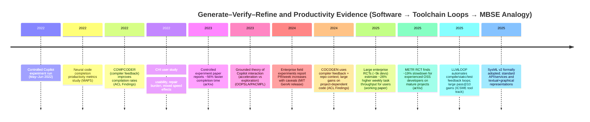

# Toolchain-Gated Generation and Productivity: Evidence from LLM-Assisted Software Development and Implications for MBSE

## Executive summary

High-quality empirical evidence from software engineering shows that AI-assisted generation can **materially speed up** developers on some tasks, but **not reliably in all settings**. A controlled experiment found that giving developers access to a code-generation assistant reduced task completion time by **55.8%** for an “implement an HTTP server” task (95% CI: **21%–89%**), with essentially no statistically significant change in task success rate. citeturn18view0 In contrast, a randomized controlled trial with **experienced open-source developers** working in mature projects found that allowing frontier (early-2025) AI tools **increased** completion time by **19%** (i.e., slowed them down), despite participants forecasting large speedups. citeturn25view0

Field evidence (large-company deployments and RCTs) is broadly consistent with “positive but heterogeneous” gains: enterprise randomized trials covering **~5,000 developers** estimate that *usage* of the assistant causes a **~26% increase** in weekly completed tasks (with substantial uncertainty), plus increases in code updates and compilation events—suggesting faster iteration cycles rather than just faster typing. citeturn5view2 Other field-experimental analyses report **~8%–22%** increases in pull requests per week in two enterprises, with caveats about compliance/power and measurement. citeturn6view1

What is stable across nearly all studies (including those with mixed or negative speed results) is a **workflow shift**: AI generation reduces some authoring/boilerplate effort, but increases time spent in **review, validation, and repair**, especially when outputs are near-correct but not quite correct. Qualitative and HCI work documents two common modes—“acceleration” (developers already know what they want) and “exploration” (developers use the model to propose options)—and finds that developers invest heavily in validation strategies (inspection, execution, documentation checks). citeturn23view0turn23view3turn5view4

For model-based systems engineering (MBSE), the analogy is direct: SysML v2 is now a formal standard with machine-readable artifacts, complementary textual/graphical representations, and standard APIs—meaning modeling workflows already have strong “toolchain acceptance” gates analogous to compilers and test suites. citeturn21view1turn26view0 The **most defensible motivation** for your paper is therefore not “LLMs are always faster,” but: **when automated generation is coupled to toolchain feedback (parse/type/consistency checks, simulation, analysis, V&V checks) and gated by acceptance criteria, it can turn high-friction modeling iterations into fast, reliable loops**—the same mechanism that appears repeatedly in software toolchains and in compiler-feedback code-generation systems. citeturn17view0turn17view1turn16view0

## What the best evidence says about developer productivity

The strongest evidence base (in causal terms) comes from randomized experiments and quasi-experimental deployments. The key point for motivating MBSE is that productivity effects are **context-dependent** (task type, developer experience, project maturity, quality bars, and integration overhead), but there is credible evidence that automation of *toolchain-acceptable* output can change throughput and iteration cadence.

### Curated table of key empirical studies and quantitative results

| Study | First author | Year | Venue | Experimental design | Main quantitative results (effect sizes) | Why relevant to “toolchain-gated” generation | Primary URL / DOI |
|---|---:|---:|---|---|---|---|---|
| *The Impact of AI on Developer Productivity: Evidence from GitHub Copilot* | entity["people","Sida Peng","cs researcher"] et al. | 2023 | arXiv (cs.SE) | Controlled experiment; **95** professional programmers recruited via entity["company","Upwork","freelancing platform"]; task: implement HTTP server; outcome: time-to-pass tests | Treatment completed **55.8% faster**; mean **71.17 min vs 160.89 min**; **p=0.0017**; 95% CI for speed gain **[21%, 89%]**; success-rate difference not statistically significant citeturn18view0 | Establishes a high-water-mark for short-horizon productivity gains when generated output is immediately “checked” by tests/CI-style gate | `https://arxiv.org/abs/2302.06590` (arXiv), DOI: `10.48550/arXiv.2302.06590` |
| *The Effects of Generative AI on High-Skilled Work: Evidence from Three Field Experiments with Software Developers* (enterprise RCTs) | entity["people","Kevin Zheyuan Cui","economics researcher"] et al. | 2025 | Working paper (MIT economics) | Three **large-scale randomized controlled trials** in real work settings; assistant access randomized; outcomes from internal task tracking and telemetry | Preferred IV estimates: **26.08%** increase in weekly completed tasks for users (SE **10.3%**); **13.55%** increase in commits (SE **10.0%**); **38.38%** increase in compilation events (SE **12.55%**). citeturn5view2 | Particularly relevant because “toolchain contact” (compiles) increases: the assistant appears to change iteration behavior, not just keystrokes—a close parallel to model-check/validate loops in MBSE | `https://economics.mit.edu/sites/default/files/inline-files/draft_copilot_experiments.pdf` |
| *The Productivity Effects of Generative AI: Evidence from a Field Experiment with GitHub Copilot* (preview of enterprise field experiments) | *(same author group; see above)* | 2024 | MIT GenAI PubPub release | Two field experiments with **1,974** developers across entity["company","Microsoft","technology company"] and entity["company","Accenture","consulting firm"]; randomized access; tracking PR throughput; notes low compliance/power in one setting | Suggestive increases in PRs/week: **12.92%–21.83%** at one firm; **7.51%–8.69%** at the other; authors caution estimates are imprecise and significance depends on specification/weighting. citeturn6view1 | Shows the “integration into real workflow” story: effects exist but require careful measurement and can be muted by adoption/integration frictions—highly analogous to MBSE rollouts | `https://mit-genai.pubpub.org/pub/v5iixksv` |
| *Measuring the Impact of Early-2025 AI on Experienced Open-Source Developer Productivity* | entity["people","Joel Becker","ai eval researcher"] et al. (entity["organization","METR","ai evaluation nonprofit"]) | 2025 | arXiv (cs.SE / cs.HC) | Randomized controlled trial: **16** experienced OSS developers; **246** tasks in mature projects (~5 years prior experience); AI allowed vs disallowed per-task | AI allowed → **19% longer** completion time (slowdown), despite participants forecasting **24%** reduction and post-task estimating **20%** reduction. citeturn25view0 | Critical balancing evidence: even with strong tools, quality bars + complex context can flip sign. Motivates *toolchain-gated* designs that reduce wasted cycles and help avoid “AI thrash” | `https://arxiv.org/abs/2507.09089` (DOI: `10.48550/arXiv.2507.09089`) |
| *Expectation vs. Experience: Evaluating the Usability of Code Generation Tools Powered by LLMs* | entity["people","Priyan Vaithilingam","hci researcher"] et al. | 2022 | CHI (Extended Abstracts) | Within-subjects user study (**24** participants) doing Python tasks with vs without assistant | Assistant did **not necessarily improve** task time or success, but most participants **preferred** it (useful starting point; less search). Participants reported difficulty understanding/editing/debugging generated code. citeturn5view4 | Highlights the core friction: gains depend on repair/understanding cost. MBSE analog: tool-accepted output reduces “syntax wrestling,” but semantic/debug cost remains | `https://tianyi-zhang.github.io/files/chi2022-lbw-copilot.pdf` (DOI: `10.1145/3491101.3519665`) |
| *Grounded Copilot: How Programmers Interact with Code-Generating Models* | entity["people","Shraddha Barke","programming languages researcher"] et al. | 2023 | PACMPL / OOPSLA | Observational + grounded theory; **20** participants across tasks/languages; codes interaction strategies | Identifies “acceleration” vs “exploration.” Quantitative traces show, e.g., in acceleration mode, **code prompts** dominate (71.4%); in exploration mode, **comment prompts** dominate (57.2% vs 13.1% in acceleration). Validation differs by mode (more deliberate examination/documentation in exploration). citeturn23view0turn23view3 | Directly supports the mechanism claim: output generation shifts effort toward validation. For MBSE, “toolchain-gated” generation aims to compress validation/repair cycles by converting tool diagnostics into structured refinement steps | `https://cseweb.ucsd.edu/~npolikarpova/publications/oopsla23-copilot.pdf` (DOI: `10.1145/3586030`) |
| *Productivity Assessment of Neural Code Completion* | entity["people","Albert Ziegler","software engineering researcher"] et al. | 2022 | MAPS (Machine Programming) | Case study combining a user survey with directly measurable usage signals from an IDE assistant | Finds that **acceptance rate** of suggestions better explains perceived productivity than persistence-style metrics (“how long suggested code survives unchanged”). citeturn15view0 | Suggests why “toolchain acceptance” can matter more than “perfect output”: users feel gains when they can quickly accept and then validate—analogous to models that reliably parse/type-check in MBSE | `https://arxiv.org/pdf/2205.06537` (DOI: `10.1145/3520312.3534864`) |
| *On the Robustness of Code Generation Techniques: An Empirical Study on GitHub Copilot* | entity["people","Antonio Mastropaolo","software engineering researcher"] et al. | 2023 | arXiv (later appeared in SE venue) | Robustness study: 892 Java methods; compare outputs under semantically equivalent prompt paraphrases | Prompt rewording changed recommendations in **~46%** of cases and could impact correctness in **~28%**. citeturn4search10 | Quantifies a key failure mode that increases repair cost: “nearby” prompts can produce meaningfully different code. MBSE analog: small phrasing differences can yield structurally different models unless gated/normalized | `https://arxiv.org/abs/2302.00438` |
| *Compilable Neural Code Generation with Compiler Feedback* (COMPCODER) | entity["people","Xin Wang","nlp researcher"] et al. | 2022 | Findings of ACL | Benchmark/system evaluation: integrates **compiler feedback** into training and selection | Compilation success improved from **44.18 → 89.18** (code completion) and **70.3 → 96.2** (text-to-code) vs a strong baseline. citeturn17view0 | “Generate–compile–repair” in a literal sense: demonstrates that compiler feedback is a powerful signal for raising the probability of toolchain-acceptable outputs | `https://aclanthology.org/2022.findings-acl.2.pdf` |
| *Iterative Refinement of Project-Level Code Context for Precise Code Generation with Compiler Feedback* (COCOGEN) | entity["people","Zhangqian Bi","nlp researcher"] et al. | 2024 | Findings of ACL | System evaluation: uses compiler feedback + static analysis to retrieve missing project context and iteratively fix errors | Reports **>80% improvement** over “vanilla” LLMs on project-context-dependent generation; outperforms retrieval baselines. citeturn17view1 | Strong closest analog to MBSE toolchains: project-specific context + strict tool feedback + iterative refinement | `https://eprints.whiterose.ac.uk/id/eprint/218627/1/2024.findings-acl.138.pdf` (DOI: `10.18653/v1/2024.findings-acl.138`) |
| *LLMLOOP: Improving LLM-Generated Code and Tests through Automated Iterative Feedback Loops* | entity["people","Ravin Ravi","software maintenance researcher"] et al. | 2025 | ICSME (Tool track) | Tool/demo paper: automates iterative loops (compile errors, static analysis, tests, mutation testing) | On HumanEval-X (Java), improves **pass@10 from 76.22% → 90.24%** vs single-shot baseline. citeturn16view0 | Shows an end-to-end *toolchain-in-the-loop* pattern in practice: making compilation/tests first-class validators materially improves success rates | `https://valerio-terragni.github.io/assets/pdf/ravi-icsme-2025.pdf` |
| *Asleep at the Keyboard? Assessing the Security of GitHub Copilot’s Code Contributions* | entity["people","Hammond Pearce","security researcher"] et al. | 2022 | IEEE S&P (accepted; arXiv preprint) | Security evaluation: 89 scenarios; 1,689 generated programs; evaluate vulnerability prevalence | Finds **~40%** of generated programs vulnerable under tested scenarios. citeturn22view0 | Not a productivity gain study, but essential for “toolchain-gated” framing: strict validators must include security/static analysis where relevant, not only syntax/compile success | `https://arxiv.org/abs/2108.09293` (DOI: `10.48550/arXiv.2108.09293`) |

## Why compilable output changes workflows

The most useful synthesis from the literature is that “productivity” is not just fewer keystrokes; it is **shorter and more reliable iteration cycles**. The studies above consistently point to three mechanisms that matter for MBSE/toolchain-gated generation.

First, **time shifts from writing to validating and repairing**. A grounded-theory study documents that programmers use AI assistants in an “acceleration” mode when they already know the plan, and an “exploration” mode when they are uncertain; importantly, each mode comes with distinct prompting patterns and validation behaviors, underscoring that the assistant’s value is inseparable from how quickly users can evaluate and correct suggestions. citeturn23view0turn23view3 A user study similarly reports that perceived usefulness can coexist with no measurable improvement in time/success if understanding and debugging costs remain high. citeturn5view4

Second, users often experience value when the assistant produces **acceptably shaped** artifacts—good enough to accept and then adapt—rather than perfectly correct ones. A case study of neural code completion finds that the **suggestion acceptance rate** correlates more with perceived productivity than “persistence” metrics about unchanged code over time, implying that “useful starting points” can dominate user value. citeturn15view0 This matches qualitative accounts that the assistant can act like a “fast junior” whose output must be reviewed and integrated. citeturn23view0

Third, “toolchain contact” is a major part of the story. In large enterprise experiments, assistant usage is associated with more frequent **compilation events** (+38.38% in one estimate), consistent with faster try-compile-fix cycles and more iterative experimentation. citeturn5view2 This is exactly where **toolchain-gated generation** matters: if a system reduces the probability of “fails-to-compile/fails-to-parse” artifacts, it prevents a large class of unproductive cycles and context switches, which are especially costly in high-standard codebases and in safety- or quality-critical contexts. citeturn25view0

## Toolchain-in-the-loop evidence from generate–compile–repair systems

Beyond human-subject productivity studies, there is direct system-level evidence that “generate–compile–repair” loops (compiler feedback, static analysis feedback, test feedback) substantially improve the probability of producing tool-accepted outputs.

A compiler-feedback training and discrimination pipeline boosts compilation success rates dramatically in benchmark settings (e.g., ~44%→~89% in code-completion compilability). citeturn17view0 For project-level generation, iterative refinement driven by compiler mismatch signals (paired with retrieval of project context) reports >80% improvements over “vanilla” LLM prompting on tasks requiring repository context. citeturn17view1 A tool demonstration that automates multiple feedback loops (compilation errors, static analysis, and test failures) reports large gains on a multi-test benchmark (pass@10 76.22%→90.24%). citeturn16view0

These systems provide strong backing for your terminology and framing:

- **Canonical technical term to cite:** “**compiler feedback**” (explicitly used in titles and abstracts of COMPCODER and COCOGEN) citeturn17view0turn17view1  
- **Canonical loop description:** “**iterative feedback loops**” (explicitly used in LLMLOOP) citeturn16view0  
- **Your paper’s adaptation for MBSE:** “**toolchain-in-the-loop**” or “**toolchain-gated refinement**,” because in SysML v2 the relevant validator is not only a compiler but a broader toolchain (parser + type system + model consistency rules + analysis/simulation hooks + API/services constraints). citeturn21view1turn26view0  

## Implications for MBSE and SysML v2 toolchains

MBSE is widely framed as a shift from document-centric to model-centric engineering. entity["organization","INCOSE","systems engineering society"] defines MBSE as the formalized application of modeling to support requirements, design, analysis, verification, and validation across the life cycle. citeturn19search0 At the same time, the MBSE literature emphasizes that many claimed benefits remain hard to quantify rigorously, so credible arguments should avoid overclaiming and instead focus on measurable mechanisms (iteration speed, reduced rework, fewer tool errors, improved traceability). citeturn12search11turn12search13

That makes SysML v2 a particularly timely target. SysML v2 has been formally adopted as a standard (with machine-readable artifacts and associated documents), and it explicitly supports modeling requirements/structure/behavior plus analysis and verification cases; it also provides complementary textual and graphical representations and a standard API/services layer to navigate/query/update models. citeturn21view1turn26view0 The official release repository and pilot implementation underscore that SysML v2 is intended to be used with concrete tooling (textual notation editors, visualization, and reference tooling). citeturn11view2turn11view3

image_group{"layout":"carousel","aspect_ratio":"16:9","query":["SysML v2 diagram example","SysML v2 textual notation example","Eclipse SysML v2 pilot implementation screenshot"],"num_per_query":1}

### MBSE/SysML v2-specific considerations that strengthen the case for toolchain-gated generation

Toolchain-gated generation aligns with the parts of MBSE that are structurally similar to software development: formal languages, strict parsers/validators, and tight coupling to downstream analysis and V&V.

SysML v2’s strength—precision, formalization, interoperability—also implies **strictness**: small syntax/type/namespace mistakes can prevent models from loading, querying, or generating views, similar to uncompilable code. citeturn21view1turn26view0 In software, studies show AI tools can either speed up or slow down depending on how much time is spent fixing near-correct output and integrating it into high-standard projects. citeturn25view0turn5view4 A toolchain gate (parse/type/consistency checks) converts this into a tighter, more reliable loop: the system can iteratively refine until the artifact is at least “tool-accepted,” reducing wasted human cycles on purely syntactic/tooling friction. citeturn17view0turn16view0

SysML v2’s API/services layer also makes “toolchain-in-the-loop” practical: a generation tool can call the API to validate that elements are present, query relationships, enforce conventions, and ensure model transformations succeed, analogous to compiler/test feedback in code pipelines. citeturn21view1turn26view0

In short: your best motivation is **not** “LLMs will design systems,” but “LLMs plus toolchain gating can reliably produce *loadable, queryable, and tool-interoperable* models, which is the prerequisite for scaling any automation across industrial toolchains.” citeturn17view1turn16view0

## Scenario-based productivity estimate for systems engineering teams

Because measured MBSE productivity deltas are far less standardized than software metrics (and MBSE benefit claims are often not backed by direct measurement), the most defensible approach is a **transparent scenario analysis** anchored in the software evidence: (i) effects can be large in controlled tasks, (ii) effects can be modest in enterprise settings, and (iii) effects can be negative in high-standard, high-context work if repair/validation dominates. citeturn18view0turn5view2turn25view0

### Assumptions (explicit)

1. **Team size:** 10 systems engineers.  
2. **Work week:** 40 hours/engineer/week.  
3. **Task types affected by toolchain-gated SysML v2 generation (25% of time):** writing/editing SysML v2 textual models; maintaining consistency; fixing tool errors (parse/type/namespace); updating model queries/views; preparing artifacts for downstream analysis/verification hooks.  
4. **Not directly affected (75% of time):** stakeholder negotiation, trade studies requiring human judgment, architecture decisions, and organizational coordination.  
5. **Acceptance criteria:** “toolchain-accepted” means the SysML v2 toolchain can parse/load the model, and automated validation checks (naming/type/consistency rules + organization-specific lint rules) pass. This is analogous to “compiles and passes baseline checks,” not “semantically correct system design.”

### Scenario table (net weekly time savings)

| Scenario | Assumed net speedup on the affected 25% of work | Hours saved per engineer per week | Hours saved per 10-engineer team per week | Equivalent capacity freed |
|---|---:|---:|---:|---:|
| Conservative | 10% | 1.0 | 10 | 0.25 FTE |
| Realistic | 25% | 2.5 | 25 | 0.625 FTE |
| Optimistic | 40% | 4.0 | 40 | 1.0 FTE |

These ranges are intentionally aligned with the *distribution* of effects seen in software: large gains in constrained tasks (~56% faster) citeturn18view0; moderate gains in enterprise settings (~8%–26% depending on metric and adoption) citeturn6view1turn5view2; and potential slowdowns when context/quality bars dominate (~19% slower). citeturn25view0

## Risks, mitigations, and ready-to-use motivation text

### Risks and failure modes

“Toolchain-accepted” is necessary but not sufficient. In software, near-correct output can still impose large hidden costs: robustness issues mean that small prompt changes can produce materially different outputs, raising review/repair burden. citeturn4search10 Security research shows that generated code can be insecure in a substantial fraction of tested scenarios, implying that acceptance gates must include security/static analysis where relevant, not only compilation. citeturn22view0 Finally, the strongest cautionary evidence is that in mature, high-standard projects, AI tools can slow experts down due to overhead, misalignment, and validation complexity. citeturn25view0

For SysML/MBSE, the analogous failure modes are: models that load but are architecturally wrong; inconsistent semantics across views; incorrect requirement allocations; broken downstream simulations; and misplaced trust that “passes validation” implies “is correct.”

### Mitigation strategies aligned with the literature

A toolchain-gated approach is best positioned when it treats generation as **proposal + validation + refinement**, with explicit safeguards:

- **Multi-layer gating:** parse/type/consistency checks first, then organization-specific lint rules, then analysis/simulation/V&V checks when available—mirroring compilation + tests + static analysis in LLMLOOP-style loops. citeturn16view0turn26view0  
- **Structured feedback to the model:** convert tool diagnostics into actionable constraints, like compiler-feedback systems do (COMPCODER/COCOGEN). citeturn17view0turn17view1  
- **Human-in-the-loop review ergonomics:** assume effort shifts to review/validation; design interfaces that support rapid inspection and traceability, consistent with the “validation-heavy” interaction patterns observed in Copilot studies. citeturn23view0turn5view4  
- **Avoid overtrust:** explicitly separate “tool-accepted” from “semantically correct,” and require targeted V&V checks for high-stakes model elements (interfaces, safety requirements, verification cases). citeturn25view0turn22view0  

### Two ready-to-use motivation sections

**Engineering / ASME-style tone (2 paragraphs)**  
Modern MBSE practice is moving toward model-centric artifacts that support requirements, design, analysis, and verification/validation across the system life cycle, but engineers still face high friction when translating intent into formal, tool-accepted models. citeturn19search0turn12search13 With SysML v2 now standardized—with complementary textual and graphical representations and a standard API/services layer for model navigation and interoperability—the practical bottleneck increasingly becomes the cost of producing and maintaining models that satisfy strict toolchain constraints while remaining consistent with downstream analysis and verification needs. citeturn21view1turn26view0

Empirical evidence from software engineering suggests that automation can accelerate development when it compresses iteration cycles and reduces low-level tool friction, but also that gains are heterogeneous and can be negative when validation and integration overhead dominates. citeturn18view0turn25view0turn5view2 We therefore focus on a conservative, engineering-aligned automation target: toolchain-gated generation that iteratively refines candidate SysML v2 artifacts until they are tool-accepted under explicit acceptance criteria, enabling engineers to spend proportionally more time on architecture and verification intent rather than syntax, configuration, and mechanical rework. citeturn17view1turn16view0turn26view0

**CS/SE empirical tone (2 paragraphs)**  
Controlled and field evidence on LLM-assisted programming indicates that the effect of generative tools on productivity is strongly context dependent. In a controlled experiment, developers with an AI coding assistant completed a standardized task substantially faster (≈56%), while a recent RCT in mature open-source projects found a slowdown (≈19%) even for experienced developers. citeturn18view0turn25view0 Large-scale enterprise RCTs estimate positive but uncertain effects on throughput and iteration behavior, including increases in compilation frequency, consistent with assisted workflows that emphasize rapid generate–check–repair cycles. citeturn5view2

Across studies, a consistent mechanism is a shift from authoring to validation and repair: programmers alternate between “acceleration” and “exploration” modes and invest heavily in inspection and execution to establish correctness. citeturn23view0turn5view4 This motivates toolchain-in-the-loop designs where validators (compiler, static analysis, tests) are first-class components of the generation system: compiler-feedback methods and iterative feedback-loop frameworks demonstrably increase the probability of producing tool-accepted and test-passing outputs. citeturn17view0turn17view1turn16view0 We argue that SysML v2—given its formal syntax, standard API, and emphasis on analysis/verification constructs—offers an analogous setting where toolchain-gated refinement can reduce wasted cycles on non-loadable/non-conformant models and create the preconditions for scalable model automation in MBSE workflows. citeturn21view1turn26view0

### Prioritized primary sources (peer-reviewed / preprints / official pages)

Peer-reviewed or archival venues first (then reputable preprints/official pages):

- *Grounded Copilot: How Programmers Interact with Code-Generating Models* (PACMPL/OOPSLA 2023). `https://cseweb.ucsd.edu/~npolikarpova/publications/oopsla23-copilot.pdf` citeturn7search2turn23view0  
- *Productivity Assessment of Neural Code Completion* (MAPS 2022). `https://arxiv.org/pdf/2205.06537` citeturn15view0  
- *Compilable Neural Code Generation with Compiler Feedback* (Findings of ACL 2022). `https://aclanthology.org/2022.findings-acl.2.pdf` citeturn17view0  
- *Iterative Refinement of Project-Level Code Context … with Compiler Feedback* (Findings of ACL 2024). `https://eprints.whiterose.ac.uk/id/eprint/218627/1/2024.findings-acl.138.pdf` citeturn17view1  
- *LLMLOOP: Improving LLM-Generated Code and Tests through Automated Iterative Feedback Loops* (ICSME 2025 tool track). `https://valerio-terragni.github.io/assets/pdf/ravi-icsme-2025.pdf` citeturn16view0  
- *Expectation vs. Experience …* (CHI EA 2022). `https://tianyi-zhang.github.io/files/chi2022-lbw-copilot.pdf` citeturn5view4  
- *The Impact of AI on Developer Productivity: Evidence from GitHub Copilot* (arXiv 2023; controlled experiment details). `https://arxiv.org/pdf/2302.06590` citeturn18view0  
- *Measuring the Impact of Early-2025 AI on Experienced Open-Source Developer Productivity* (arXiv 2025 RCT). `https://arxiv.org/abs/2507.09089` citeturn25view0  
- SysML v2 formal specification entry (“About SysML 2.0,” normative documents and machine-readable artifacts). `https://www.omg.org/spec/SysML/2.0/About-SysML` citeturn26view0  
- SysML v2 final adoption press release and key capabilities (textual/graphical representations, standard API, analysis/verification cases). `https://www.omg.org/news/releases/pr2025/07-21-25.htm` citeturn21view1  
- SysML v2 release repo and pilot implementation (reference tooling & documents). `https://github.com/Systems-Modeling/SysML-v2-Release` and `https://github.com/Systems-Modeling/SysML-v2-Pilot-Implementation` citeturn11view2turn11view3  

### Mermaid timeline of key empirical and systems milestones

