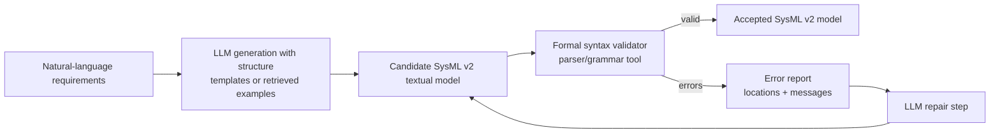

# LLM-Based Generation of Syntactically Valid SysML v2 Textual Models

## Executive summary

Published, citable methods for using large language models (LLMs) to generate **syntactically valid SysML v2 textual models** do exist as of early 2026, including both a peer‑reviewed journal article and multiple arXiv preprints. The strongest peer‑reviewed evidence is a 2025 *Computers in Industry* article that reports **100% syntactic validity** on a curated set of **20 natural‑language prompts** by combining (i) retrieval‑augmented prompting over SysML v2 examples with (ii) an **iterative validation-and-repair loop** driven by a SysML v2 grammar-based parser. citeturn25view1turn25view2

A complementary arXiv preprint (SysTemp) reports that a **template‑based, multi‑agent pipeline**—notably a “skeleton” template generator plus a parser agent that surfaces syntax errors—can achieve **error‑free parser validation in 4/5 scenarios (80%)** within a limited ablation study. citeturn5view0

Separately, a large arXiv benchmark (SysMBench) provides evidence that *even strong general LLMs and code LLMs still struggle* to generate SysML v2 textual models directly from requirements, reporting **very low BLEU scores (best ≈4%)** and only **moderate semantic correctness (best SysMEval‑F1 ≈62%)** across 151 scenarios. The benchmark also shows that “grammar prompting” (injecting BNF into a prompt) can increase surface similarity while harming semantic precision—suggesting that *syntax steering in prompts alone is not a reliable substitute for tool‑based validation*. citeturn15view0turn16view0

Across the SysML v2–specific literature found here, **the dominant technical pattern is not fine‑tuning or constrained decoding**, but rather **prompt engineering + external structure** (templates/RAG) **+ a formal validation loop** (parsers/grammars) providing corrective feedback. Evidence of SysML v2–specific fine‑tuning or token‑level grammar‑constrained decoding (e.g., constrained beam search) was not apparent in the primary methods that were accessible in full text in this review. citeturn25view0turn5view0turn16view0

## Scope, definitions, and search strategy

This report focuses on *published* (peer‑reviewed or preprint) methods where an LLM is used to generate **SysML v2 textual notation** (“SysML v2 code”) that is syntactically valid—i.e., parses under a SysML v2 grammar / tooling validator—rather than generating only diagrams, prose descriptions, or SysML v1 artifacts. SysML v2 matters here because it is intended to support more code‑like / textual workflows and standardized APIs, and it is distributed with specification documents and example models via an official release repository. citeturn24search3turn23search1turn5view0

Operationally, the report treats **syntactic validity** as *passing a formal parser or syntax validator* (ANTLR/Xtext-style front‑end), because this is the validation mechanism explicitly used (and quantified) in the most rigorous SysML v2 generation paper found. citeturn25view0turn25view1turn25view2

The evidence base below is drawn from:
- SysML v2 official pages and release repositories describing SysML v2 artifacts (spec docs, example models, pilot implementation) citeturn24search3turn23search1turn24search16  
- Peer‑reviewed journal work and arXiv preprints explicitly targeting SysML v2 generation from natural language citeturn25view0turn5view0turn15view0  
- Open-source tooling relevant to parsing/validation and example corpora that are repeatedly cited as the available SysML v2 sources citeturn4search18turn4search14turn8search5turn8search0  

## SysML v2 syntax and the validation toolchain context

SysML v2 is positioned by the standards community as a “next‑generation systems modeling language,” emphasizing increased precision, interoperability, and usability relative to SysML v1. citeturn24search3turn23search1

Two aspects of SysML v2 are foundational to LLM-based syntactically valid generation research:

First, SysML v2 is distributed with **specification documents and example models** in an official release repository, which also includes installation guidance for **pilot implementation editors** and developer tooling. citeturn23search1turn24search10

Second, multiple sources in the generation literature treat SysML v2 as having (at least) **a concrete (textual) syntax** and an **abstract syntax** that can be manipulated through APIs. For example, SysTemp describes SysML v2 as having an abstract syntax “expressed in JSON” and a concrete syntax “in code form,” and it explicitly motivates generating the concrete syntax with LLMs because it is shorter and more human‑oriented. citeturn5view0

A key enabling factor for “syntactically valid” claims is the existence of parsers/validators. The peer‑reviewed SysML v2 generation paper below implements syntactic validation using a lexer+parser workflow and emphasizes that syntax checks are necessary but insufficient for semantics. citeturn25view0turn25view2

## Published methods and comparison

### Evidence of SysML v2–targeted generation methods

At least two **SysML v2–explicit** generation methods are described in accessible full text:

- A peer‑reviewed agent‑based framework that integrates **Retrieval‑Augmented Generation (RAG)** with **iterative syntactic (and some semantic) validation**, reporting quantitative syntactic validity rates. citeturn25view0turn25view1turn25view2  
- An arXiv preprint describing a multi‑agent pipeline where a **template/skeleton agent** structures generation and a **parser agent** finds syntax errors in a repair loop, reporting convergence outcomes. citeturn5view0  

A third highly relevant source is SysMBench, a benchmark and evaluation framework that explicitly prompts models to “create an OMG SysML v2 textual model,” and evaluates 17 LLMs under multiple prompt strategies, including grammar prompting (BNF-in-prompt). While SysMBench is primarily an evaluation artifact rather than a new synthesis pipeline, it is directly informative about what *does not* work reliably (direct prompting) and what partially helps (grammar prompting). citeturn15view0turn16view0

### Process flow archetype

Across the “successful” methods, the core architectural pattern is:

- **Structure the generation problem** (templates or retrieved exemplars), then  
- **Generate**, then  
- **Validate with a formal parser**, then  
- **Repair iteratively** until the validator passes.



This is consistent with the SysTemp “WriterAgent–ParserAgent” loop and with the journal paper’s explicit “SysML Generator / Syntax Validator / SysML Fixer” toolchain. citeturn5view0turn25view0turn25view1

### Comparison table of identified methods

| citation | method summary | model type | syntactic validity reported | dataset | code available (Y/N) | notes |
|---|---|---|---|---|---|---|
| entity["people","Eduardo Cibrián","sysml v2 agent paper"] et al., 2025 (*Computers in Industry*) | Agent architecture combining **RAG over curated SysML v2 examples** + **iterative validation/repair** using a SysML v2 grammar-based validator; implemented via an agent toolset (“Generator,” “Validator,” “Fixer”). citeturn25view0turn25view1 | Uses **GPT‑4o‑mini** via entity["company","OpenAI","ai company"] API + embedding retrieval. citeturn6view0 | **100% syntactic validity** for the full agent on N=20 prompts; baselines reported **0% syntactic validity**. citeturn25view1 | **N=20 prompts** curated from SysML v2 spec/examples; supporting example DB built from official SysML v2 models with expert-written descriptions; **data “available on request.”** citeturn6view0turn25view2 | N | The paper is open access under **CC BY‑NC**, but does not provide a public code repository in the text shown; it frames validity as parser acceptance. citeturn25view0turn25view2 |
| entity["people","Yasmine Bouamra","sysml v2 systemp author"] & Poisson et al., 2025 (arXiv SysTemp) | Multi-agent pipeline: extract requirements → build **structured dictionary** → generate **syntactically correct skeleton** via templating rules → fill skeleton → **parser agent** surfaces syntax errors; iterative correction loop. citeturn5view0 | Evaluated with closed models (GPT‑4 Turbo, Claude 3.5 Sonnet). citeturn5view0 | Reports convergence to parser-validated syntax in **4/5 scenarios (80%)** with the template agent vs **1/5** without it. citeturn5view0 | 5 hand-crafted scenarios (bicycle domain); notes scarcity of public SysML v2 examples (<150 scenarios across two major repos). citeturn5view0turn4search14 | Partial | Prompts + templating rules are included in the appendix; an associated benchmark repo exists (not peer reviewed). citeturn5view0turn19view0 |
| entity["people","Dongming Jin","sysmbench author"] et al., 2025 (arXiv SysMBench) | Benchmark + evaluation metric (SysMEval) for NL→SysML model generation; evaluates prompt strategies including **grammar prompting (BNF in prompt)**; focuses on semantic claim checking using GPT‑4 for evaluation. citeturn15view0turn16view0 | 17 LLMs (general + code LLMs) evaluated under multiple prompting strategies. citeturn15view0turn16view0 | Does **not** foreground a parser-based “validity rate” for generated outputs in the excerpted text; shows that “grammar prompting” raises BLEU but can reduce semantic precision. citeturn16view0 | **151 scenarios** curated from public teaching materials + repositories; includes textual models + rendered diagrams; claims open release of dataset/framework. citeturn15view0turn16view0 | Y (claimed) | Strong evidence that *prompt steering alone* is not enough for correctness; highlights common SysML errors (e.g., missing imports, grammar misuse). citeturn16view0 |

## Evaluation metrics and datasets

### Evaluation metrics actually used in the SysML v2 generation literature

The peer‑reviewed agent-based method uses explicit **syntactic validity rate (%)** as a headline metric and reports it in a results table alongside “solved prompts” and a manual quality score. citeturn25view1turn25view2

SysTemp uses a more process-oriented syntactic metric: it counts **syntax errors detected** by a parser agent across iterations and reports whether the loop converges to a parser-validated model. It uses an ablation study to quantify the impact of adding a template skeleton stage. citeturn5view0

SysMBench argues that conventional text similarity metrics miss critical aspects of modeling languages, and introduces SysMEval to measure semantic correctness/completeness by decomposing models into “atomic claims” and checking support against a reference model; it still reports BLEU/ROUGE/BERTScore as baselines and explains tradeoffs in grammar prompting. citeturn15view0turn16view0

### Reported results and what they imply about syntactic validity

The strongest quantitative syntactic claim comes from the 2025 journal article: **SysMLAgent achieves 100% syntactic validity on all 20 prompts**, while “LLM-only” baselines (including another LLM) show **0% syntactic validity**, and an ablation without RAG collapses to 20% validity—suggesting the *combination* of retrieval grounding and validation-driven repair is decisive. citeturn25view1

SysTemp’s results are consistent with that narrative: providing an initial structured skeleton makes the repair loop much more likely to converge to a parser‑validated model (80% vs 20% success in their small study). citeturn5view0

SysMBench complements these “success cases” with scale and realism: despite multiple prompt strategies, it finds that LLMs “perform poorly” overall, with the best BLEU around 4% and best SysMEval‑F1 around 62%, and it documents failure patterns such as missing imports and misuse of specialization. citeturn15view0turn16view0

### Datasets and corpora used, availability, and licensing

A recurring constraint is **data scarcity** for SysML v2 textual models. SysTemp states that SysML v2 resources are “limited” and points to two principal public sources totaling fewer than ~150 scenarios. citeturn5view0turn4search14

The agent-based journal paper constructs:
- A **prompt dataset (N=20)** derived from official SysML v2 specification constructs and examples, citeturn6view0turn25view2  
- A **curated local repository of SysML v2 models + human-written model descriptions** for retrieval grounding, derived from official documentation. citeturn6view0  

It explicitly states: **“Data will be made available on request.”** citeturn25view2 In addition, the paper indicates it is open access under a CC BY‑NC license. citeturn25view0

SysMBench provides a larger dataset of **151 scenarios**, created by crawling public SysML teaching materials and repositories, then manually cleaning and annotating requirements and labels; it claims release of the benchmark and framework for future research. citeturn15view0turn16view0

Some open repositories that materially expand the public SysML v2 corpus include an explicitly licensed SysML v2 model collection under BSD‑3‑Clause. citeturn4search14

## Tooling and implementations

### SysML v2 reference artifacts and editors

The official SysML v2 release repository includes specification documents, example models, and installation instructions; it also explicitly mentions Eclipse plugin installers and a SysML kernel for Jupyter with JupyterLab integration. citeturn23search1turn24search10

The standards community notes that SysML v2 beta specifications were adopted and that an open-source pilot implementation exists to validate them. citeturn24search16

The pilot implementation itself is maintained as an open repository intended to support reproducible development environments and tooling. citeturn4search18

### Parsers and grammar-derived tooling used for validation loops

Multiple open-source projects expose SysML v2 parsing capability via ANTLR-derived grammars, enabling the kinds of validation loops used in the generation papers:

- A Python toolchain (PySysML2) includes an ANTLR4 grammar (`SysML.g4`) and a CLI capable of exporting SysML v2 textual models into multiple formats, and it documents how the parser/visitor ties the textual model to tooling. citeturn8search5  
- A SysML v2 parser repo for HAMR explicitly states it holds “generated ANTLR v4 grammar and Java parser/lexer from SysML v2 Pilot Implementation.” citeturn8search0  

This matters because the most successful published generation approach uses grammar-driven validation and repair to guarantee syntactic acceptance. citeturn25view1turn25view2

### LLM-generation prototypes and benchmarks (non–peer reviewed, but useful)

A public Git repository associated with SysTemp’s authorship stream describes a SysML v2 “benchmark” exploration and includes code that generates SysML v2 from descriptions by injecting examples from nearby clusters/folders into prompts (a lightweight RAG-by-exemplars pattern). citeturn19view0turn20view0turn5view0

### Links

```text
SysML v2 official overview page:
https://www.omg.org/sysml/sysmlv2/

SysML v2 Release repository (spec PDFs, examples, installers):
https://github.com/Systems-Modeling/SysML-v2-Release

SysML v2 Pilot Implementation:
https://github.com/Systems-Modeling/SysML-v2-Pilot-Implementation

Open SysML v2 model corpus (BSD-3-Clause):
https://github.com/GfSE/SysML-v2-Models

PySysML2 (ANTLR-based parsing toolkit):
https://github.com/DAF-Digital-Transformation-Office/PySysML2

SysML v2 Parser for HAMR (ANTLR grammar/parser derived from pilot impl):
https://github.com/sireum/hamr-sysml-parser

SysMLv2-Benchmark (prompt+examples generation scripts; non-peer reviewed):
https://github.com/yasminebouamra/SysMLv2-Benchmark
```

## Authoritative quotes, limitations, failure modes, and open gaps

### Direct quotations establishing the state of methods and constraints

> “The automatic generation of SysML v2 models represents a major challenge … due to the scarcity of learning corpora and complex syntax.” citeturn5view0

> “With the TemplateGeneratorAgent, near-systematic convergence is achieved … validated by the ParserAgent in 80% of the scenarios (4 out of 5).” citeturn5view0

> “The system integrates Retrieval-Augmented Generation (RAG) … and enforces compliance through a validation engine based on the official ANTLR grammar.” citeturn25view0

> “SysMLAgent (GPT‑4o‑mini) … Syntactic validity Rate (%) 100” (with LLM-only baselines shown at 0). citeturn25view1

> “We present SysMBench … 151 human-curated scenarios … Our in-depth evaluation shows that LLMs perform poorly … highest BLEU of 4% and SysMEval-F1 of 62%.” citeturn15view0

### Limitations and failure modes evidenced in the sources

The most rigorous validation-first method is still limited by **small evaluation size** and incomplete public reproducibility. The journal paper explicitly notes its dataset size (N=20) as a generalizability constraint and states: **“Data will be made available on request.”** citeturn25view2turn6view0

SysTemp’s central limitation is the same one it identifies as the motivating barrier: SysML v2 public corpora are small, and the study evaluates only five scenarios in a narrow domain, so the 80% convergence result is suggestive rather than dispositive. citeturn5view0

SysMBench shows that even when models are instructed to return “only valid SysML v2 code,” the outputs often contain domain-specific mistakes (e.g., missing imports, misuse of specialization keywords) and that grammar-in-prompt steering can create a **precision–recall tradeoff** that deteriorates semantic correctness. citeturn16view0turn15view0

An additional practical gap is the **misalignment risk between “spec grammars” and “tool grammars.”** The official release repository contains issue reports asserting that parts of the textual grammar in the specification document have “lots of errors” and do not match the implementation—an important caution for any approach that aims to enforce syntax via a static grammar extracted from the spec rather than using the reference toolchain as the oracle. citeturn23search9

### Open research gaps for “syntactically valid” SysML v2 generation

Current published methods that report high syntactic validity do so primarily by **post-generation validation and repair**, not by *generation-time guarantees*. That leaves several open problems implied by the literature:

- **Token-level constrained decoding for SysML v2** (generation-time CFG enforcement) is not demonstrated in the accessible SysML v2–specific synthesis papers, even though generic grammar-constrained decoding methods exist in NLP. citeturn25view1turn5view0turn16view0turn3academia20  
- **Semantic correctness beyond “parseability”** remains under-addressed: even the strongest validation-first paper explicitly distinguishes syntax from deeper semantics; SysMBench shows semantic degradation under grammar prompting. citeturn25view2turn16view0  
- **Toolchain integration beyond standalone pipelines** (e.g., robust plugins for mainstream modeling environments) is not described as open and reproducible in these sources; the literature emphasizes custom pipelines and reference tools rather than vendor‑tool plugins. citeturn23search1turn25view2turn5view0  
- **Standardized, community‑accepted benchmarks for SysML v2 validity & semantics** are still emerging; SysTemp explicitly calls out the “absence of standard benchmarks,” and SysMBench is an important step but does not yet make syntactic validity a first-class reported metric for LLM outputs. citeturn5view0turn15view0turn25view2  

## Recommended next research steps

The published evidence suggests the most productive near-term research directions are those that combine the scale and rigor of SysMBench-style evaluation with the validation-oracle architecture used in the best syntactic-validity results.

First, extend SysMBench-style datasets with **parser-validity labels** (pass/fail + error categories) and publish a standard “syntactic validity rate” protocol, using the **reference implementation parser** or a clearly versioned grammar toolchain as the oracle. This aligns with the central role of formal validation in the highest-validity method and addresses the benchmark’s own concern that surface metrics miss structural correctness. citeturn25view1turn16view0turn23search9

Second, evaluate **generation-time constraints**: implement grammar-constrained decoding (CFG/EBNF) against a SysML v2 grammar that is demonstrably aligned with the toolchain, then compare (i) syntactic validity, (ii) semantic correctness, and (iii) efficiency/latency against the iterative “repair loop” baselines that already reach 100% syntactic validity on small N. citeturn25view1turn25view2turn3academia20

Third, formalize **semantic validation layers** beyond grammar checks: the strongest agent-based method acknowledges the importance of semantics and uses at least some semantic checks, while SysMBench shows semantics are fragile under syntax steering. A promising direction is to combine parser validity with metamodel-level constraints and/or executable checks that reflect SysML v2 intended semantics. citeturn25view2turn16view0

Finally, improve reproducibility: the journal result is compelling but constrained by “data on request” and missing public code in the surfaced text. A community-grade reference pipeline should publish (i) prompts, (ii) retrieval corpus construction, (iii) validator versioning, and (iv) evaluation scripts—mirroring SysMBench’s “release the benchmark and evaluation framework” posture while adding syntactic validity as a first-class artifact. citeturn25view2turn15view0